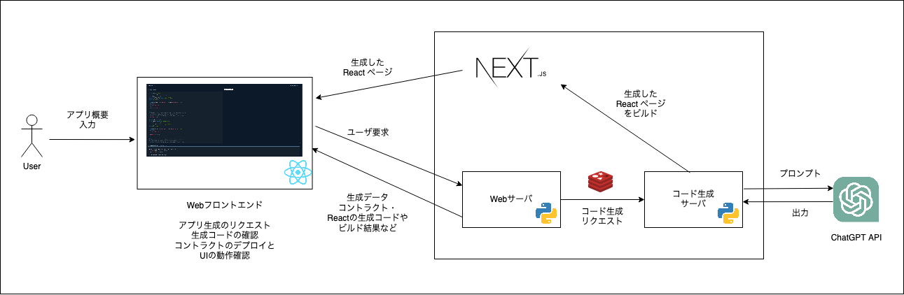

# SmartTailor

こちらは AI+Crypto Hackathon で作成したプロダクトになります。  
This is a product developed through AI+Crypto Hackathon.

## プロダクトの概要

こちらは、ChatGPT APIを使用したDAppsの自動作成ツールです。  
あなたが欲しいアプリの概要を一言入力するだけで、AIがスマートコントラクトとReactアプリを生成します。 
ブロックチェーンの知識やWeb3開発経験が無くても、入力に応じて必要な機能が実装されたアプリケーションを一式を得ることができます。

## キャッチコピー

Web3の知識が無くても、欲しい機能をあなたのために即座に実装

## 背景やターゲット

ブロックチェーン技術やスマートコントラクトは急速に普及しています。特にここ数年はDeFiなどの金融分野だけで無く、身近なアプリケーションへの適用が増えています。しかしながら、Web3エンジニアの人口は他の業界と比較してもまだまだ少ない状況です。これは、Web3の技術は独自の概念や考え方があり、既存のエンジニアであっても学習の敷居が高い点が一つ挙げられます。 

AIによるコードの自動生成は大きく分けて2つの活用方法があると考えています。  
1つ目はプロトタイプ作成をローコストで実現することです。ビジネスにおいて様々なアイデアを検証することは重要ですが、実際に動くようなアプリケーションを開発するには、小さくない時間的・人的コストが発生します。コードの自動生成によってそのようなコストが小さくなるため、検証を容易に行うことができます。また、生成したアプリケーションをベースに実際のプロダクト開発に活かす事ができるようになります。  
2つ目は学習教材としての活用です。まだまだ、スマートコントラクト開発などの教材は多くは無い状況です。プログラミングを学ぶ上で一番大変なことは、自分が考えている内容をどのようにコードで表現するのかを学ぶことです。既存のアプリのコードを手本とした場合、まずのそのアプリがどのような機能や特徴があるかを知っておかないと、コードを見てもどう実装されているのかを把握するのは困難です。また、初心者向けの学習教材は文法などを習得するのには最適ですが、実アプリケーションを意識した知識を習得するのは難しいです。AIによって自分が欲しい機能を持つアプリケーションを生成することによって、アプリの前提知識が小さくて済み、学習コストを下げることができます。　　

## 使い方

ユーザはブラウザのみを使用します。まず、トップページにあるフォームに自分が欲しいアプリの概要を書きます。その後、サーバサイドでのコード生成が完了すると、ブラウザでSolidityとReactのコードを見ることができます。また、生成したReactページを確認することができるため、同じ画面上でコントラクトのデプロイとコントラクトの操作をすることができます。

## アーキテクチャ

大きく分けて、Webフロントエンドとサーバサイドに分かれます。　　

WebフロントエンドはReactとethersを使用しています。AIが生成したフロントエンドはNext.jsサーバでビルドを行ったものを、Webアプリ上で動的に取得して表示しています。現状、コードを解析して必要なパッケージを動的にインストールする機能が無いため、フロントの実装には`ethers`を使用するように設定しています。

バックエンドは、フロントエンドからのリクエストを受け付けるためのWebサーバと、コード生成を行うコード生成サーバが動いています。コード生成サーバはChatGPT APIを呼び出して、各種タスクを実行します。入力から一括でスマートコントラクトを生成するのでは無く、以下のような複数のフローを経てコードを生成します。

1. ユーザが入力したアプリ概要から、アプリケーションに必要な機能を列挙する
2. 1の結果を元に、スマートコントラクトの関数やフィールドなどのインタフェースを定義する
3. 2の結果を元に、スマートコントラクトのコードを実装する
4. スマートコントラクトをビルドし、ビルドエラー発生した場合は、そのエラーを元にコードの修正を行う
5. スマートコントラクトをビルドして得られたABI (Application Binary Interface)を元に、スマートコントラクトと対話するためのReactアプリケーションを実装する

その他、Webサーバとコード生成サーバにリクエストを送るためのRedisサーバと、生成したReactアプリを個別にビルドするためのNext.jsサーバが動いています。

## 今後の計画

元々、DApps開発でビジネスロジック以外の部分を自動生成させることによりDApps開発の速度を向上したくて実装しました。例えば、トークンの発行や送信などは色々なスマートコントラクトで実装されていますが、このようなコードを自動生成できれば、人間はビジネスロジックの実装に注力することができます。そのため、元々はユーザがインタフェースやテストケースを定義し、AIがその仕様に基づきコントラクトを生成するようなユースケースを想定していました。しかしながら、コンパイル結果やテスト結果に基づくコード修正の精度が思ったより上がらなかったため、今回は概要からMVP向けアプリケーションを開発するようなシステムにしました。  

ChatGPT自体がプログラミングに最適なLLMというわけでは無いため、他のLLMを使用することで精度向上が期待できると思います。  

その他にUXを向上させるために、以下のようなことを今後取り組んでいきたいと思っています。
* 複数ファイルのコントラクトやReactコードの生成への対応
* ユーザが生成したコードを編集して、再ビルドを行えるようにする機能
* AIによる追加機能の実装や実装のアドバイスを行う機能
* テストの自動生成またはテストを動かす機能
* コンパイルエラーやテスト結果に応じてコードを自動修正するエージェントの実装
* プログラミング言語に適したLLMを使用するなどして、実装の精度を向上
